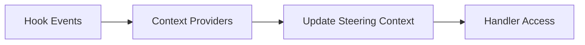
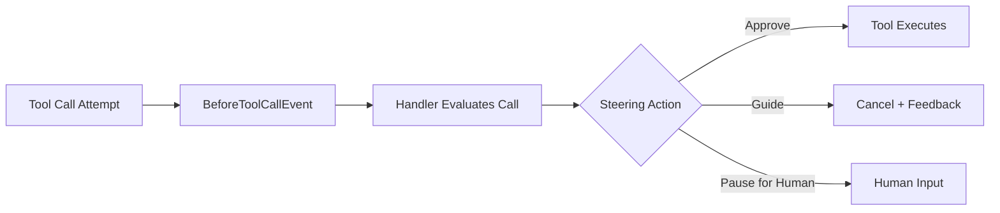
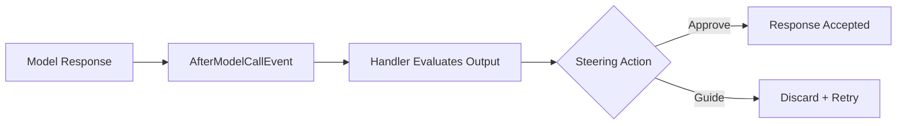
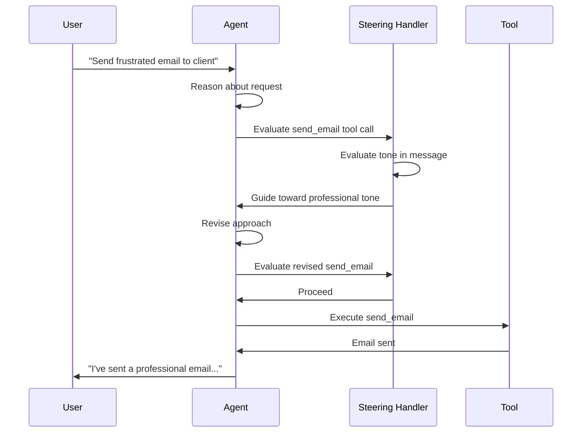

Steering provides modular prompting for complex agent tasks through context-aware guidance that appears when relevant, rather than front-loading all instructions in monolithic prompts. Steering handlers observe agent activity and intervene at key moments — before a tool call or after a model response — with targeted feedback. They are built on the [interventions](/docs/user-guide/concepts/agents/interventions/index.md) framework and use the same typed action model.

Python SDK

In Python, steering handlers use the [plugins](/docs/user-guide/concepts/plugins/steering/index.md) interface rather than interventions. See [Steering (Plugins)](/docs/user-guide/concepts/plugins/steering/index.md) for the Python API reference including `LLMSteeringHandler` and context providers.

## What Is Steering?

Building agents for complex multi-step tasks runs into a prompting wall. Traditional approaches require front-loading all instructions, business rules, and operational guidance into a single prompt. For tasks with 30+ steps, monolithic prompts become unwieldy: agents ignore instructions, hallucinate behaviors, or fail to follow critical procedures.

A common workaround is decomposing the agent into a graph with predefined nodes and edges that control execution flow. While this improves predictability and reduces prompt complexity, it limits the adaptive reasoning that makes agents valuable in the first place, and it is costly to maintain as requirements change.

Steering takes a different approach: **modular prompting**. Instead of front-loading all instructions, you define context-aware steering handlers that provide feedback at the right moment. Each handler defines the business rules to enforce and the lifecycle hooks where agent behavior should be validated, like before a tool call or before returning output to the user.

## Comparison with Other Approaches

### Steering vs. Workflow Frameworks

Workflow frameworks force you to specify discrete steps and control flow logic upfront, making agents brittle and requiring extensive developer time to define complex decision trees. When business requirements change, you rebuild the workflow logic. Steering uses modular prompting where you define contextual guidance that appears when relevant rather than prescribing exact execution paths. This maintains the adaptive reasoning that makes agents valuable while enabling reliable execution of complex procedures.

### Steering vs. Traditional Prompting

Traditional prompting requires front-loading all instructions into a single prompt. For complex tasks with 30+ steps, this leads to prompt bloat where agents ignore instructions, hallucinate behaviors, or fail to follow critical procedures. Steering provides context-aware reminders that appear at the right moment, like post-it notes that guide agents when they need specific information. This keeps context windows lean while maintaining agent effectiveness on complex tasks.

## Context Population

To give the handler something to reason about, attach a provider that observes agent activity and records it as steering context.



**Context Providers** observe agent activity and contribute structured data into the handler’s steering context. The built-in `ToolLedgerProvider` tracks tool call history, timing, and results. Steering handlers read from this context when deciding whether to intervene.

## Intervention Points

### Before a Tool Call

When you want the handler to validate a tool call before it runs, return a steering action from `beforeToolCall`:



The handler returns one of three actions:

-   **`InterventionActions.proceed()`**: tool executes immediately
-   **`InterventionActions.guide(feedback)`**: tool is cancelled, agent receives contextual feedback and retries
-   **`InterventionActions.confirm(prompt)`**: tool execution pauses for human approval

### After a Model Response

When you want the handler to validate the model’s output before it reaches the user, return a steering action from `afterModelCall`:



The handler returns one of two actions:

-   **`InterventionActions.proceed()`**: accept the response as-is
-   **`InterventionActions.guide(feedback)`**: discard the response and retry with guidance injected into the conversation

## Writing Custom Steering Logic

`SteeringHandler` extends `InterventionHandler` and narrows the return types to enforce a steering-specific contract:

| Method | Valid Returns | Purpose |
| --- | --- | --- |
| `beforeToolCall` | `Proceed | Guide | Confirm` | Gate or redirect a tool call |
| `afterModelCall` | `Proceed | Guide` | Validate model output before delivery |

The wider intervention vocabulary (`Deny`, `Transform`) is excluded at the type level — out-of-contract actions are caught at compile time. Subclass `SteeringHandler` when you want to write imperative steering logic:

```typescript
import { Agent, tool, InterventionActions } from '@strands-agents/sdk'
import type { BeforeToolCallEvent, AfterModelCallEvent } from '@strands-agents/sdk'
import { SteeringHandler } from '@strands-agents/sdk/vended-interventions/steering'
import { z } from 'zod'

class ToneSteeringHandler extends SteeringHandler {
  override readonly name = 'tone-steering'

  override beforeToolCall(event: BeforeToolCallEvent) {
    if (event.toolUse.name === 'send_email') {
      const input = event.toolUse.input as Record<string, string>
      if (input.message?.includes('URGENT') || input.message?.includes('!!!')) {
        return InterventionActions.guide(
          'Rewrite the email with a calmer, more professional tone. ' +
            'Avoid all-caps words and excessive punctuation.'
        )
      }
    }
    return InterventionActions.proceed()
  }

  override afterModelCall(_event: AfterModelCallEvent) {
    return InterventionActions.proceed()
  }
}

const agent = new Agent({
  tools: [sendEmail],
  interventions: [new ToneSteeringHandler()],
})

await agent.invoke('Send an urgent email to the team about the deadline')
// Handler detects "URGENT" → guides agent to rewrite with calmer tone → email sends
```

`SteeringHandler` also implements `LifecycleObserver`. When the agent initializes, it calls `observeAgent(agent)` on each intervention handler that implements this interface. `SteeringHandler` forwards this call to its registered context providers, allowing them to self-subscribe to agent hooks.

## Steering with Natural Language

When you want to express steering rules in natural language rather than imperative code, use `LLMSteeringHandler`. It delegates decisions to an LLM that evaluates each tool call against your system prompt and the accumulated steering context.

```typescript
import { Agent, tool } from '@strands-agents/sdk'
import { LLMSteeringHandler } from '@strands-agents/sdk/vended-interventions/steering'
import { z } from 'zod'

const handler = new LLMSteeringHandler({
  systemPrompt: `
    You are providing guidance to ensure the agent follows best practices:

    Rules:
    - Emails must always include a clear subject line
    - Never send emails with aggressive or unprofessional language
    - If the same tool has failed twice in a row, suggest a different approach
    - Require human confirmation before sending emails to external domains
  `,
})

const agent = new Agent({
  tools: [sendEmail, searchWeb],
  interventions: [handler],
})

await agent.invoke('Email the client about the project delay')
// LLM evaluates tone and content → may guide agent to soften language before sending
```



### Configuration

| Option | Type | Default | Description |
| --- | --- | --- | --- |
| `systemPrompt` | `string | SystemContentBlock[]` | *(required)* | Steering rules for the evaluation LLM |
| `model` | `Model` | Parent agent’s model | Model used for steering evaluation |
| `contextProviders` | `SteeringContextProvider[]` | `[new ToolLedgerProvider()]` | Providers that supply evaluation context. Pass `[]` to disable |
| `promptBuilder` | `PromptBuilder` | Built-in builder with cache points | Custom function to build evaluation prompts |
| `name` | `string` | `'strands:llm-steering-handler'` | Unique handler name (must be distinct if multiple handlers are attached) |

### How it works

1.  Before each tool call, the handler collects context snapshots from all registered providers.
2.  It builds an evaluation prompt combining your system prompt, the context data, and the pending tool call details.
3.  A **fresh inner Agent** evaluates the prompt and returns a structured decision: `proceed`, `guide`, or `confirm`.
4.  The decision maps to the corresponding intervention action.

The inner agent is constructed fresh per evaluation — this keeps the handler stateless and safe for concurrent evaluations across multiple parent agents.

The default prompt builder uses **prompt caching**: static instructions are separated from dynamic context with a `CachePointBlock`, reducing API costs for repeated evaluations within the same session.

For best practices on writing steering prompts, see the [Agent Standard Operating Procedures (SOP)](https://github.com/strands-agents/agent-sop) framework.

## What the Handler Sees

Context providers are passive observers that track agent activity and supply structured data to steering handlers. They implement the `SteeringContextProvider` interface:

-   **`name`** — identifier for the provider instance
-   **`observeAgent(agent)`** — called once at initialization; subscribe to hooks here
-   **`context`** (getter) — returns the current context snapshot for steering evaluation

```typescript
import { Agent, tool, AfterToolCallEvent } from '@strands-agents/sdk'
import type { LocalAgent } from '@strands-agents/sdk'
import {
  LLMSteeringHandler,
  ToolLedgerProvider,
} from '@strands-agents/sdk/vended-interventions/steering'
import type {
  SteeringContextProvider,
  SteeringContextData,
} from '@strands-agents/sdk/vended-interventions/steering'
import { z } from 'zod'

class ToolCallCounter implements SteeringContextProvider {
  readonly name = 'toolCallCounter'
  private _count = 0

  observeAgent(agent: LocalAgent): void {
    agent.addHook(AfterToolCallEvent, () => {
      this._count += 1
    })
  }

  get context(): SteeringContextData {
    return { type: 'toolCallCounter', totalCalls: this._count }
  }
}

const handler = new LLMSteeringHandler({
  systemPrompt: `
    Monitor tool usage. If the agent has made more than 5 tool calls,
    guide it to wrap up and produce a final answer.
  `,
  contextProviders: [new ToolCallCounter(), new ToolLedgerProvider()],
})

const agent = new Agent({
  tools: [searchWeb],
  interventions: [handler],
})

await agent.invoke('Research the history of quantum computing')
// After 5+ tool calls, handler guides the agent to wrap up and produce a final answer
```

Providers self-register their hooks via `observeAgent` — the steering handler does not need to know which hooks a provider uses. This keeps concerns cleanly separated: providers observe, handlers decide.

## ToolLedgerProvider

The built-in `ToolLedgerProvider` tracks tool call history within a session. It records:

-   Tool name and input arguments
-   Start and end timestamps
-   Execution status (`pending`, `success`, `error`)
-   Result content and error messages

This gives the steering LLM visibility into patterns like repeated failures, excessive retries, or tool usage sequences.

```typescript
import { Agent, tool } from '@strands-agents/sdk'
import {
  LLMSteeringHandler,
  ToolLedgerProvider,
} from '@strands-agents/sdk/vended-interventions/steering'
import { z } from 'zod'

const ledger = new ToolLedgerProvider({
  maxEntries: 50,
  name: 'my-app:tool-ledger',
})

const handler = new LLMSteeringHandler({
  systemPrompt: `
    You monitor tool call patterns. If a tool has failed 3 times consecutively,
    guide the agent to try a different approach rather than retrying.
  `,
  contextProviders: [ledger],
})

const agent = new Agent({
  tools: [searchWeb, sendEmail],
  interventions: [handler],
})

await agent.invoke('Find contact info for Acme Corp and send them a proposal')
// If search_web fails 3 times, handler guides agent to try a different approach
```

| Option | Type | Default | Description |
| --- | --- | --- | --- |
| `maxEntries` | `number` | `100` | Maximum tool calls to retain (oldest dropped) |
| `name` | `string` | `'strands:steering:toolLedger'` | Provider instance identifier |

`LLMSteeringHandler` creates a `ToolLedgerProvider` by default if you don’t specify `contextProviders`. Pass an empty array to disable it, or combine it with your own providers for richer context.

## Related topics

-   [Interventions](/docs/user-guide/concepts/agents/interventions/index.md) — The typed action model, lifecycle methods, evaluation order, and error handling
-   [Hooks](/docs/user-guide/concepts/agents/hooks/index.md) — Low-level event callbacks that context providers subscribe to
-   [Steering (Python)](/docs/user-guide/concepts/plugins/steering/index.md) — Python-specific steering using the plugins interface

## Related pages

- [Agent Loop](/docs/user-guide/concepts/agents/agent-loop/index.md) (3 shared tags)
- [Hooks](/docs/user-guide/concepts/agents/hooks/index.md) (3 shared tags)
- [Interrupts](/docs/user-guide/concepts/interrupts/index.md) (3 shared tags)
- [Interventions](/docs/user-guide/concepts/agents/interventions/index.md) (3 shared tags)
- [Plugins](/docs/user-guide/concepts/plugins/index.md) (2 shared tags)
- [Tool Executors](/docs/user-guide/concepts/tools/executors/index.md) (2 shared tags)
- [Creating a Custom Model Provider](/docs/user-guide/concepts/model-providers/custom_model_provider/index.md) (1 shared tag)
- [Retry Strategies](/docs/user-guide/concepts/agents/retry-strategies/index.md) (1 shared tag)
- [Bidirectional Streaming Hooks](/docs/user-guide/concepts/bidirectional-streaming/hooks/index.md) (1 shared tag)
- [Human in the Loop](/docs/user-guide/concepts/agents/interventions/human-in-the-loop/index.md) (1 shared tag)
