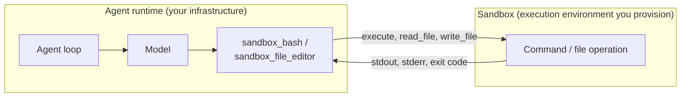

Agents are most effective when they can perform real actions rather than being constrained to text-only reasoning: executing shell commands, running code, and reading and writing files. But giving an agent unrestricted access to your host machine, especially the ability to run model-generated code, is a serious security risk.

A `Sandbox` gives the agent an execution environment for these operations while keeping the agent’s core process (model calls, hooks, state) decoupled. Now, the agent can run shell commands, write and execute code, and access a filesystem without compromising the host or its own runtime.

## How sandboxes work

There are two ways to think about sandboxed agents: running the entire agent *inside* a sandbox (a deployment concern, not an SDK feature), or giving the agent a sandbox *to use* for execution while the agent itself stays in your trusted infrastructure.

Strands implements the second pattern. The agent process runs on your host and handles model calls, tools, hooks, and state. The sandbox is a pluggable backend that receives only execution operations via a standard interface.



All Sandbox implementations share the same abstract interface:

| Method | Description |
| --- | --- |
| `execute_streaming` `executeStreaming`  | Run a shell command, stream output |
| `execute_code_streaming` `executeCodeStreaming`  | Run code via an interpreter, stream output |
| `read_file` `readFile`  | Read a file as bytes |
| `write_file` `writeFile`  | Write bytes to a file |
| `remove_file` `removeFile`  | Delete a file |
| `list_files` `listFiles`  | List directory contents |

The execution methods accept optional parameters: `timeout` (seconds, throws `SandboxTimeoutError` when exceeded), `cwd` (working directory override), `env` (environment variables), and in TypeScript, `signal` (AbortSignal, throws `SandboxAbortError`).

## Getting started

Pass a sandbox to an agent through the `sandbox` parameter, and the agent’s commands and file operations will execute inside it.

(( tab "TypeScript" ))
```typescript
import { Agent } from '@strands-agents/sdk'
import { DockerSandbox } from '@strands-agents/sdk/sandbox/docker'

const agent = new Agent({
  sandbox: new DockerSandbox({ container: 'my-container-id' }),
})

// The agent's sandbox_bash and sandbox_file_editor tools execute inside the container
await agent.invoke('List all files inside the current directory')
```
(( /tab "TypeScript" ))

(( tab "Python" ))
```python
agent = Agent(sandbox=DockerSandbox("my-container-id"))

# The agent's sandbox_bash and sandbox_file_editor tools execute inside the container
agent("List all files inside the current directory")
```
(( /tab "Python" ))

The default is not a sandbox

Omitting the `sandbox` parameter runs the agent’s command and file tools directly on the host with the full permissions of the agent process. Treat this as convenience for trusted, local development only. For untrusted input or production runs, pass an explicit sandbox.

In TypeScript, pass `sandbox: false` to opt out explicitly and keep that intent stable if the default changes:

```typescript
// Explicit opt-out: no sandbox, run on host
const agent = new Agent({ sandbox: false })
```

See [Available Sandboxes](/docs/user-guide/concepts/sandbox/available-sandboxes/index.md) for Docker and SSH configuration options, programmatic access, and streaming output.

## Using tools with sandboxes

### Default tools

When a sandbox is configured, the agent automatically registers two tools so the model can operate in the sandboxed environment without additional setup:

-   **`sandbox_bash`** — Executes shell commands. Each call runs in a fresh shell; state such as variables and the working directory does not persist across calls.
-   **`sandbox_file_editor`** — Views, creates, and edits files using absolute paths. Supports view (with line ranges), create, string replace, and insert operations.

If a tool with the same name is already registered on the agent, the sandbox-vended version is skipped. This lets you override a vended tool with a stricter variant:

(( tab "TypeScript" ))
```typescript
import { Agent } from '@strands-agents/sdk'
import { DockerSandbox } from '@strands-agents/sdk/sandbox/docker'
import { makeBash } from '@strands-agents/sdk/vended-tools/bash'

const sandbox = new DockerSandbox({ container: 'agent-workspace' })

const lockedBash = makeBash(sandbox, {
  name: 'sandbox_bash',
  description: 'Run read-only shell commands. Do not modify files.',
})

// The agent keeps lockedBash; the sandbox's own sandbox_bash is skipped
const agent = new Agent({ sandbox, tools: [lockedBash] })
```
(( /tab "TypeScript" ))

(( tab "Python" ))
```python
from strands.vended_tools import make_bash

sandbox = DockerSandbox("agent-workspace")

locked_bash = make_bash(
    sandbox=sandbox,
    name="sandbox_bash",
    description="Run read-only shell commands. Do not modify files.",
)

# The agent keeps locked_bash; the sandbox's own sandbox_bash is skipped
agent = Agent(sandbox=sandbox, tools=[locked_bash])
```
(( /tab "Python" ))

Custom sandbox implementations can also override `get_tools()` `getTools()`  to vend their own tools entirely.

### Custom tools

You can add your own tools alongside the auto-vended ones by creating a tool that reads the sandbox from its context and passing it in the agent’s `tools` array:

(( tab "TypeScript" ))
```typescript
import { Agent, tool } from '@strands-agents/sdk'
import { DockerSandbox } from '@strands-agents/sdk/sandbox/docker'
import { z } from 'zod'

const lint = tool({
  name: 'lint',
  description: 'Lint a file and return structured errors',
  inputSchema: z.object({
    path: z.string().describe('File path to lint'),
  }),
  callback: async (input, context) => {
    const result = await context!.agent.sandbox.execute(
      `eslint --format json ${input.path}`
    )
    const issues = JSON.parse(result.stdout)
    return issues.flatMap((f: any) => f.messages)
  },
})

const agent = new Agent({
  sandbox: new DockerSandbox({ container: 'my-dev-env' }),
  tools: [lint],
})
// Agent now has: sandbox_bash, sandbox_file_editor (vended) + lint (yours)
```
(( /tab "TypeScript" ))

(( tab "Python" ))
```python
@tool(context="tool_context")
async def lint(path: str, tool_context: ToolContext) -> list:
    """Lint a file and return structured errors.

    Args:
        path: File path to lint.
        tool_context: Injected by the framework.
    """
    result = await tool_context.agent.sandbox.execute(f"eslint --format json {path}")
    issues = json.loads(result.stdout)
    return [msg for file in issues for msg in file["messages"]]


agent = Agent(
    sandbox=DockerSandbox("my-dev-env"),
    tools=[lint],
)
# Agent now has: sandbox_bash, sandbox_file_editor (vended) + lint (yours)
```
(( /tab "Python" ))

Your custom tools coexist with the auto-vended ones. The sandbox routes all execution to the same environment regardless of which tool initiated it.

## Using plugins with sandboxes

The following vended plugins route their file I/O through the agent’s sandbox when one is configured:

-   **[Agent Skills](/docs/user-guide/concepts/plugins/skills/index.md)** — Skill files loaded from filesystem paths are read through the agent’s sandbox. Skills stored inside a container or on a remote host are accessible without copying them to the host. URL and inline skill sources are sandbox-independent.
-   **[Context Offloader](/docs/user-guide/concepts/plugins/context-offloader/index.md)** — When using `FileStorage` as the storage backend, offloaded artifacts are written to and read from the sandbox’s filesystem rather than the host. The plugin binds to the agent’s sandbox during initialization; no explicit wiring is needed.

## Next steps

-   [Available Sandboxes](/docs/user-guide/concepts/sandbox/available-sandboxes/index.md) — the built-in Docker and SSH backends, programmatic access, and streaming
-   [Building a Custom Sandbox](/docs/user-guide/concepts/sandbox/custom-sandbox/index.md) — target a backend the built-ins do not cover
-   [Vended Tools](/docs/user-guide/concepts/tools/vended-tools/index.md) — the `sandbox_bash` and `sandbox_file_editor` tools

## Related pages

- [Available Sandboxes](/docs/user-guide/concepts/sandbox/available-sandboxes/index.md) (2 shared tags)
- [Building a Custom Sandbox](/docs/user-guide/concepts/sandbox/custom-sandbox/index.md) (2 shared tags)
- [Creating a Custom Model Provider](/docs/user-guide/concepts/model-providers/custom_model_provider/index.md) (1 shared tag)
- [Tool Executors](/docs/user-guide/concepts/tools/executors/index.md) (1 shared tag)
- [Human in the Loop](/docs/user-guide/concepts/agents/interventions/human-in-the-loop/index.md) (1 shared tag)
- [Cedar Authorization](/docs/user-guide/concepts/agents/interventions/cedar-authorization/index.md) (1 shared tag)
- [Hooks](/docs/user-guide/concepts/agents/hooks/index.md) (1 shared tag)
- [Steering](/docs/user-guide/concepts/agents/interventions/steering/index.md) (1 shared tag)
- [Agent Loop](/docs/user-guide/concepts/agents/agent-loop/index.md) (1 shared tag)
- [Agents as Tools with Strands Agents SDK](/docs/user-guide/concepts/multi-agent/agents-as-tools/index.md) (1 shared tag)
